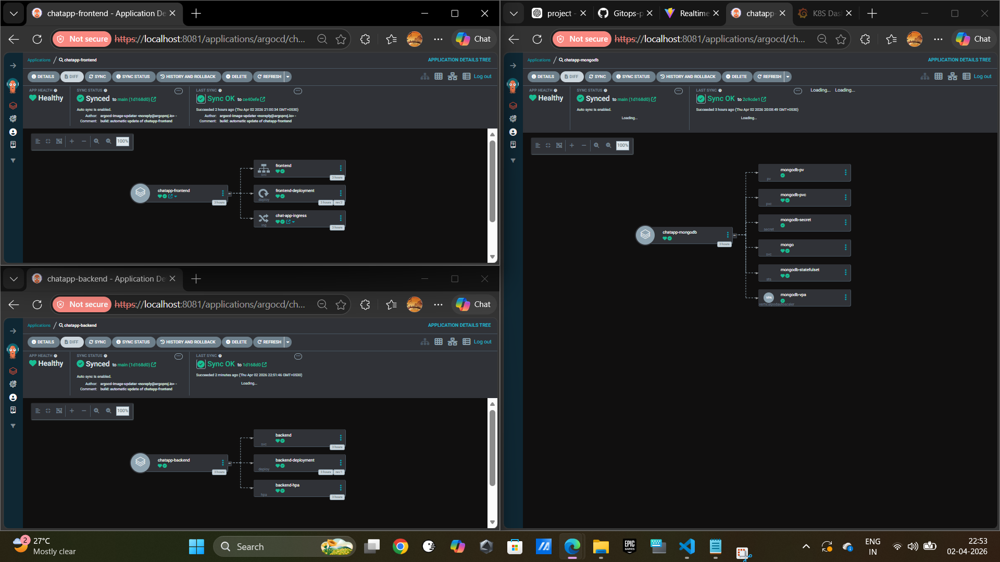

# 🚀 Complete GitOps CI/CD Pipeline for Chat Application

This project demonstrates a **production-ready GitOps-based CI/CD workflow** for deploying a full-stack chat application using **Terraform, GitHub Actions, Docker, Kubernetes, ArgoCD, and ArgoCD Image Updater**.

It showcases how modern DevOps practices can fully automate the software delivery lifecycle — from infrastructure provisioning to application deployment and monitoring.

---

## 🔥 Key Capabilities

* ⚙️ Infrastructure provisioning using Terraform (EKS)
* 🔄 Continuous Integration using GitHub Actions
* 🚀 GitOps-based Continuous Deployment with ArgoCD
* 🔁 Automated image updates with ArgoCD Image Updater
* ☸️ Scalable Kubernetes-based deployment

---

# 1. 🐳 Local Development (Docker Compose)

Before deploying to Kubernetes, the application can be tested locally using Docker Compose.

## Services

The `docker-compose.yml` defines:

* **MongoDB** – Persistent database layer
* **Backend** – Node.js API connected to MongoDB
* **Frontend** – Nginx-served web UI

All services communicate over a shared Docker network, simulating a production-like environment.

## ▶️ Run the Application

```bash id="3z4m6d"
docker compose up -d
```

## 🌐 Access the Application

* Frontend: http://localhost:8081
* Backend: http://localhost:5001
* MongoDB: localhost:27017

### 📸 Screenshot


---

# 2. ☁️ Infrastructure Provisioning (Terraform - EKS)

Terraform provisions a **fully automated AWS EKS cluster along with all required add-ons and GitOps components** using a modular and scalable architecture.

---

## ⚙️ How Terraform Automates Everything

A single command:

```bash id="1m7b6h"
terraform apply
```

provisions and configures the entire environment end-to-end.

---

### 🔹 1. Network Module

* Creates **SSH Key Pair**
* Fetches **default VPC**
* Retrieves **subnets across multiple AZs**
* Configures **custom Security Group** with required ports

### 📸 Screenshot


---

### 🔹 2. EKS Cluster Module

Using the official AWS EKS module:

* Provisions **EKS Cluster (v1.29)**
* Enables **public & private API access**
* Configures **Managed Node Group**
* Instance type: `t3.xlarge`
* Disk size: 30GB

### 📸 Screenshot


---

### 🔹 3. Dynamic Kubernetes Access

Terraform automatically configures:

* Kubernetes provider
* Helm provider
* Kubectl provider

Using secure authentication via AWS CLI (`aws eks get-token`), enabling direct interaction with the cluster.

---

### 🔹 4. Add-ons Deployment (Automated)

Using Helm and Kubectl providers:

#### Installed Components:

* Metrics Server
* NGINX Ingress Controller
* ArgoCD
* Prometheus & Grafana
* Vertical Pod Autoscaler (VPA)

### 📸 Screenshot


---

### 🔹 5. ArgoCD Setup via Terraform

Terraform bootstraps the GitOps layer by:

* Creating Git credentials secret
* Installing ArgoCD Image Updater
* Applying Kubernetes manifests:

  * AppProject
  * ApplicationSet

### 📸 Screenshots


---

### 🔹 6. Image Updater Automation

* Installs ArgoCD Image Updater
* Monitors DockerHub for new images
* Automatically updates Kubernetes manifests

### 📸 Screenshot


---

## ⚡ End Result

After execution:

* Fully operational EKS cluster
* All add-ons installed
* GitOps pipeline configured
* Applications deployed automatically

### 📸 Deployment Proof


---

## 📸 Terraform Execution Proof


---

## 💡 Key Highlight

This project demonstrates **true GitOps bootstrapping using Terraform**, where:

👉 Infrastructure provisioning + application deployment are fully automated
👉 No manual intervention required after initial setup

---

# 3. 🔁 CI Pipeline (GitHub Actions)

CI is implemented using GitHub Actions for efficient and automated builds.

## ⚙️ Pipeline Features

* Triggered on push to `main`
* Detects changes in:

  * frontend
  * backend
* Builds only modified services
* Uses **semantic versioning (v1.0.x)**
* Pushes images to DockerHub

## 🔍 Workflow Logic

* Smart change detection using `git diff`
* Skips unnecessary builds
* Automatically increments version tags
* Builds and pushes Docker images per service

### 📸 Screenshots


---

# 4. ☸️ Kubernetes Deployment (Manifests)

Kubernetes manifests are maintained in Git and act as the **single source of truth**.

## Components

### Frontend

* Deployment
* Service

### Backend

* Deployment
* Service
* HPA (Horizontal Pod Autoscaler)

### MongoDB

* StatefulSet
* Headless Service
* Persistent Volume (PV)
* Persistent Volume Claim (PVC)
* Secret

### Ingress

* NGINX Ingress for external traffic routing

### 📸 Screenshot


---

# 5. 🔄 GitOps Deployment (ArgoCD)

ArgoCD continuously synchronizes Kubernetes manifests from Git.

## Workflow

* Git acts as the **single source of truth**
* ArgoCD monitors repository changes
* Automatically syncs cluster state

### 📸 Screenshots




---

## AppProject

Defines:

* Allowed repositories
* Destination clusters
* Namespace restrictions

### 📸 Screenshot


---

## ApplicationSet

* Dynamically creates applications
* Scales easily for multiple services
* Eliminates manual app creation

### 📸 Screenshot


---

# 6. 🔁 ArgoCD Image Updater

Automates image updates without modifying manifests manually.

## Functionality

* Detects new Docker images
* Updates image tags in Git
* Triggers ArgoCD sync automatically

👉 Enables **true continuous deployment**

### 📸 Screenshot


---

# 7. 📊 Monitoring (Prometheus + Grafana)

Monitoring stack provides observability into the system.

* Prometheus → Metrics collection
* Grafana → Visualization dashboards

### 📸 Screenshots


---

# 8. 🌐 Application Working

The application is successfully deployed and accessible via Kubernetes Ingress.

### 📸 Screenshots


---

# ✅ Key Achievements

* End-to-end GitOps implementation
* Fully automated CI/CD pipeline
* Zero manual deployment process
* Scalable and production-ready architecture
* Efficient resource utilization with autoscaling

---

# 🚀 Conclusion

This project demonstrates a **modern cloud-native DevOps workflow**, where:

* Terraform provisions infrastructure
* GitHub Actions handles CI
* ArgoCD manages CD
* Image Updater automates deployments

👉 Resulting in a **fully automated, scalable, and reliable delivery pipeline**.
