# Complete GitOps CI/CD Pipeline for Chat Application

This project demonstrates a **complete GitOps-based CI/CD workflow** for deploying a full-stack chat application using **Terraform, GitHub Actions, Docker, Kubernetes, ArgoCD, and ArgoCD Image Updater**.

The system automates:

* Infrastructure provisioning (EKS)
* Continuous Integration (CI)
* GitOps-based Continuous Deployment (CD)
* Automated image updates
* Kubernetes-based deployment

---

# 1. Local Development (Docker Compose)

Before deploying through the pipeline, the application can be tested locally using Docker Compose.

## Services

The `docker-compose.yml` defines:

* **MongoDB** – Database with persistent storage
* **Backend** – Node.js API connected to MongoDB
* **Frontend** – Web interface served via Nginx

All services run inside a shared Docker network.

## Run the Application

```bash
docker compose up -d
```

## Access the Application

* Frontend: http://localhost:8081
* Backend: http://localhost:5001
* MongoDB: localhost:27017

### 📸 Screenshots

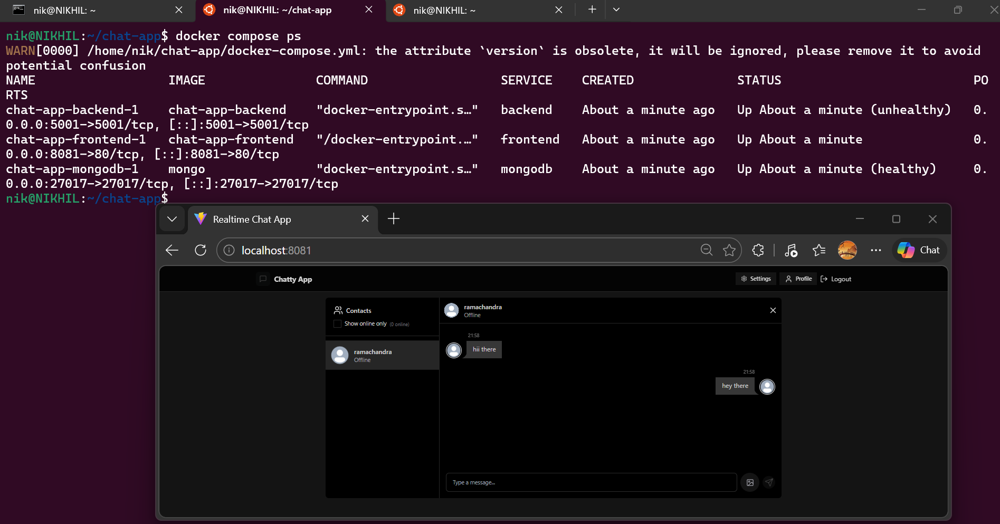

---

# 2. Infrastructure Provisioning (Terraform - EKS)

Terraform is used to provision a **fully automated AWS EKS environment along with all required add-ons and GitOps components** using a modular approach.

---

## 🔧 How Terraform Automates Everything

A single command:

```bash
terraform apply
```

performs the complete setup:

---

### 🔹 1. Network Module

* Creates **SSH Key Pair**
* Fetches **default VPC**
* Retrieves **subnets across AZs**
* Creates **custom Security Group** with required ports

### 📸 Screenshots

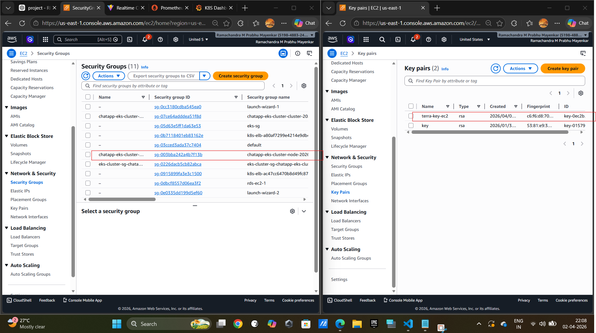

---

### 🔹 2. EKS Cluster Module

Using the official EKS module:

* Creates **EKS Cluster (v1.29)**
* Configures **public + private endpoint access**
* Sets up **Managed Node Group**
* Instance type: `t3.xlarge`
* Disk: 30GB

### 📸 Screenshots

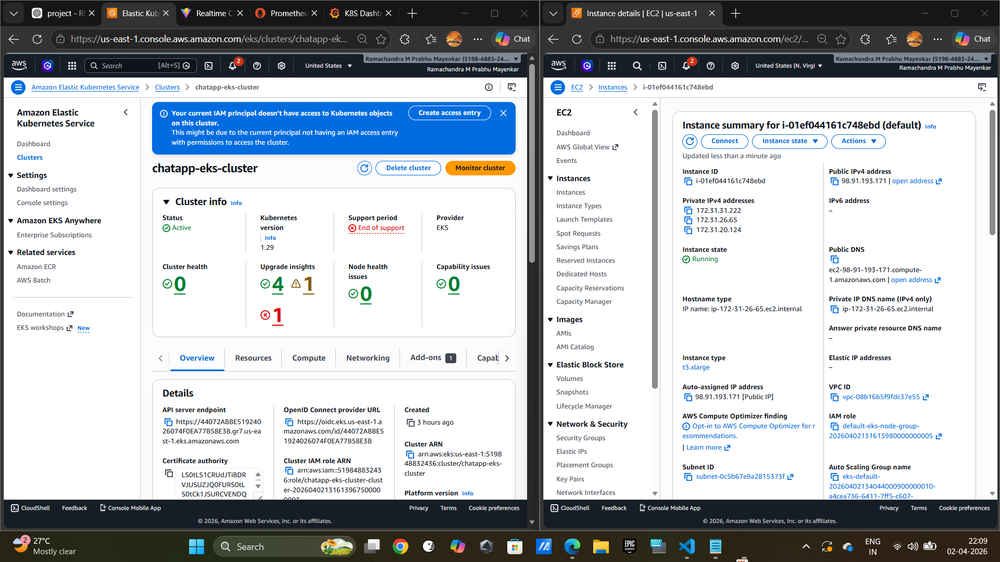

---

### 🔹 3. Dynamic Kubernetes Access

Terraform automatically configures:

* Kubernetes provider
* Helm provider
* Kubectl provider

Using:

* EKS cluster endpoint
* Authentication via AWS CLI

---

### 🔹 4. Add-ons Deployment (Fully Automated)

Using Helm + Kubectl inside Terraform:

#### Installed Components:

* Metrics Server
* NGINX Ingress Controller
* ArgoCD
* Prometheus + Grafana
* Vertical Pod Autoscaler (VPA)

### 📸 Screenshots

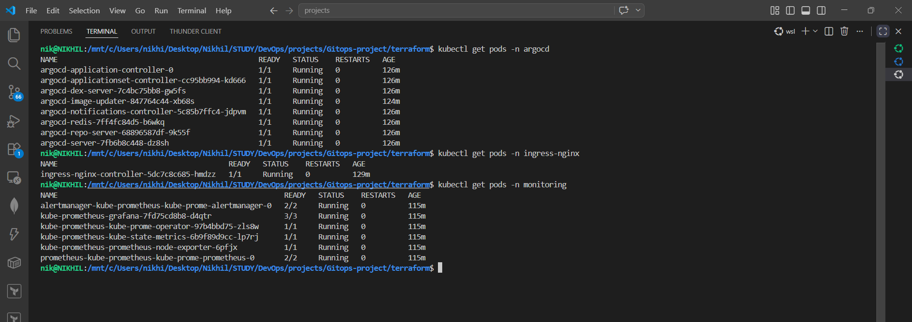

---

### 🔹 5. ArgoCD Setup via Terraform

Terraform also:

* Creates Git credentials secret
* Installs Image Updater
* Applies:

  * AppProject
  * ApplicationSet

### 📸 Screenshots

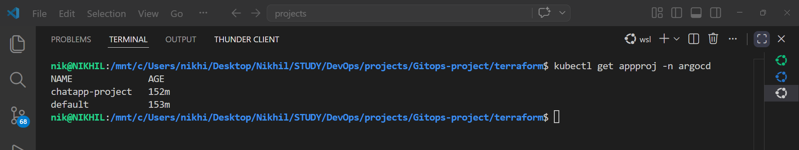
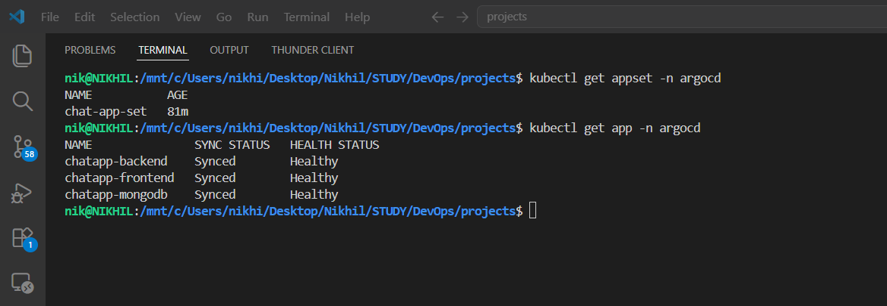

---

### 🔹 6. Image Updater Automation

* Installs ArgoCD Image Updater
* Waits until deployment is ready

### 📸 Screenshots

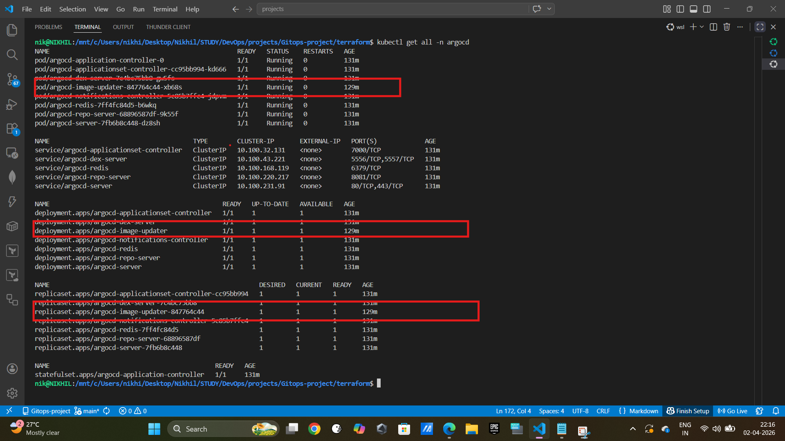

---

## ⚡ End Result

After `terraform apply`, you get:

* Fully working EKS cluster
* All add-ons installed
* ArgoCD configured
* Applications deployed automatically

### 📸 Final Deployment Proof

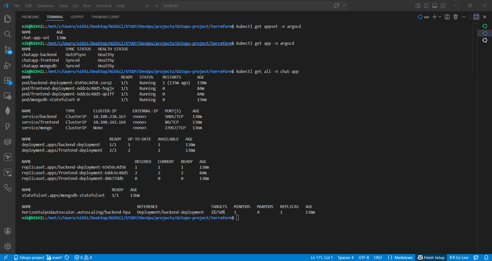

---

## 📸 Terraform Execution Proof

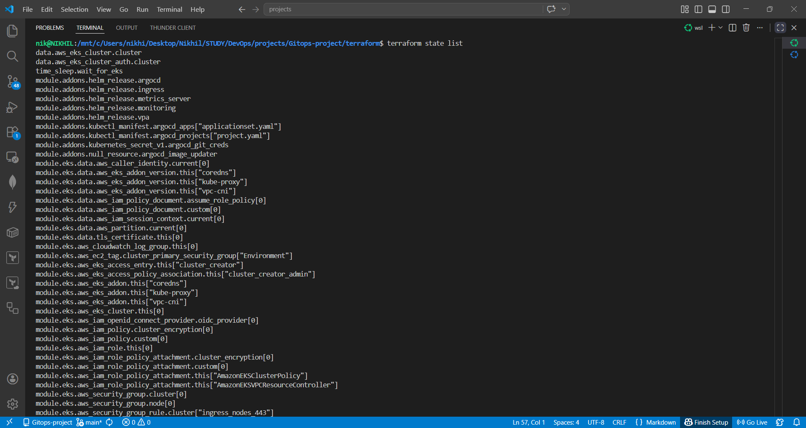
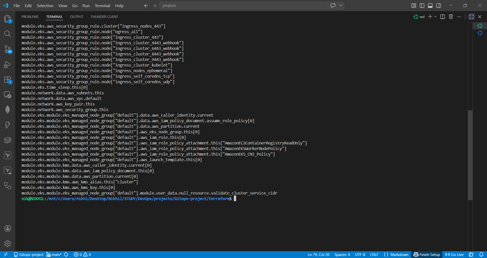
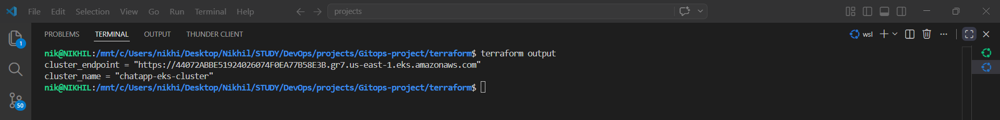

---

## 💡 Key Highlight

This setup demonstrates **true Infrastructure as Code + GitOps bootstrap**, where:

👉 Terraform provisions infrastructure
👉 Installs all add-ons
👉 Bootstraps ArgoCD
👉 Deploys applications automatically

---

# 3. CI Pipeline (GitHub Actions)

CI is implemented using GitHub Actions to automate Docker image builds and pushes.

## Pipeline Features

* Triggered on push to `main`
* Detects changes in:

  * frontend
  * backend
* Builds only modified services
* Uses **semantic versioning (v1.0.x)**
* Pushes images to DockerHub

## Workflow Logic

* Uses `git diff` to detect changed folders
* Skips pipeline if no relevant changes
* Automatically increments version tags
* Builds and pushes Docker images per service

This ensures **efficient and optimized CI execution**.

### 📸 Screenshots

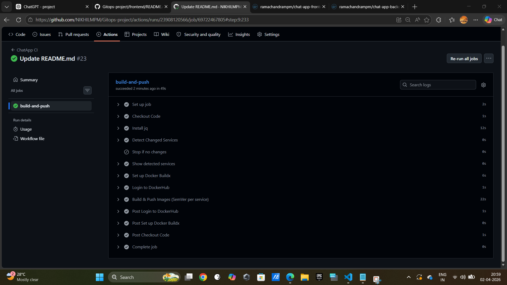
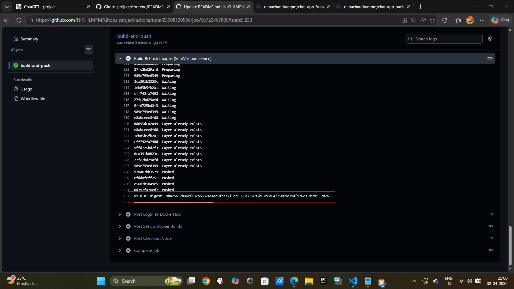
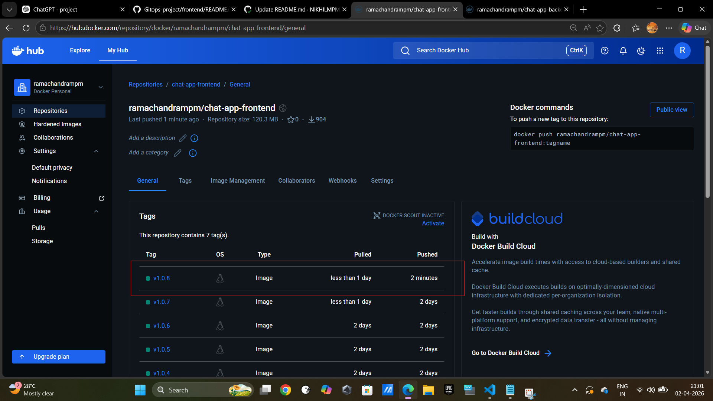

---

# 4. Kubernetes Deployment (Manifests)

Kubernetes manifests are stored in Git and act as the **single source of truth**.

## Components

### Frontend

* Deployment
* Service

### Backend

* Deployment
* Service
* HPA (Horizontal Pod Autoscaler)

### MongoDB

* StatefulSet
* Headless Service
* Persistent Volume (PV)
* Persistent Volume Claim (PVC)
* Secret

### Ingress

* NGINX Ingress routes external traffic

This ensures **scalability, persistence, and high availability**.

### 📸 Screenshots

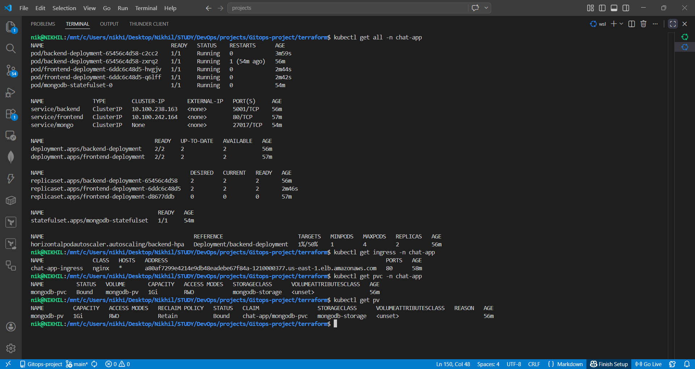

---

# 5. GitOps Deployment (ArgoCD)

ArgoCD implements GitOps for continuous deployment.

## Workflow

* Kubernetes manifests are stored in Git
* ArgoCD continuously monitors the repository
* Any change in manifests triggers automatic deployment

### 📸 Screenshots

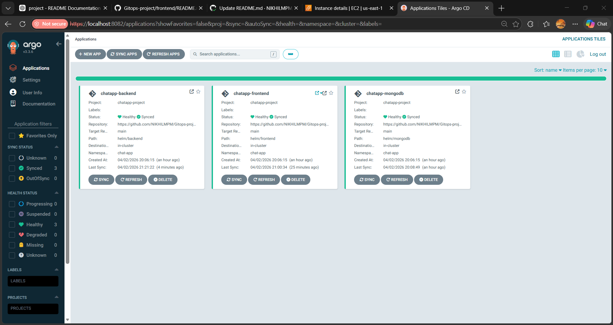
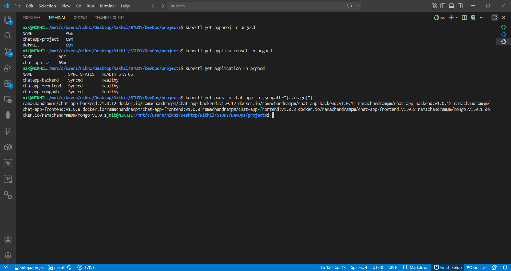

---

## AppProject

Defines:

* Allowed repositories
* Destination clusters
* Namespace restrictions

Ensures **controlled and secure deployments**.

### 📸 Screenshots

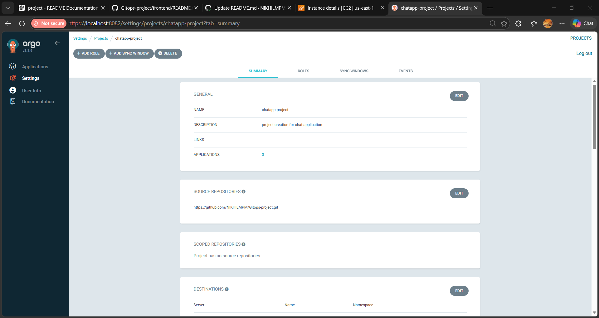

---

## ApplicationSet

Automatically generates applications for:

* frontend
* backend

Benefits:

* No need to create apps manually
* Scales easily for multiple services
* Maintains consistency

### 📸 Screenshots


---

# 6. ArgoCD Image Updater

Automates image updates in Kubernetes manifests.

## Functionality

* Detects new Docker images in DockerHub
* Updates image tags in manifests
* Triggers ArgoCD sync automatically

This enables:

👉 **Fully automated deployments without manual changes**

### 📸 Screenshots

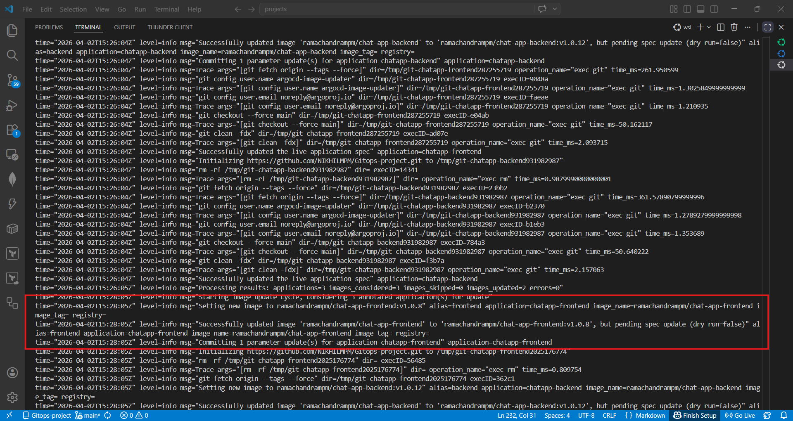

---

# 7. Monitoring (Prometheus + Grafana)

Monitoring is implemented using:

* Prometheus – Collects metrics
* Grafana – Visualizes metrics

Provides real-time insights into:

* Cluster performance
* Application health

### 📸 Screenshots

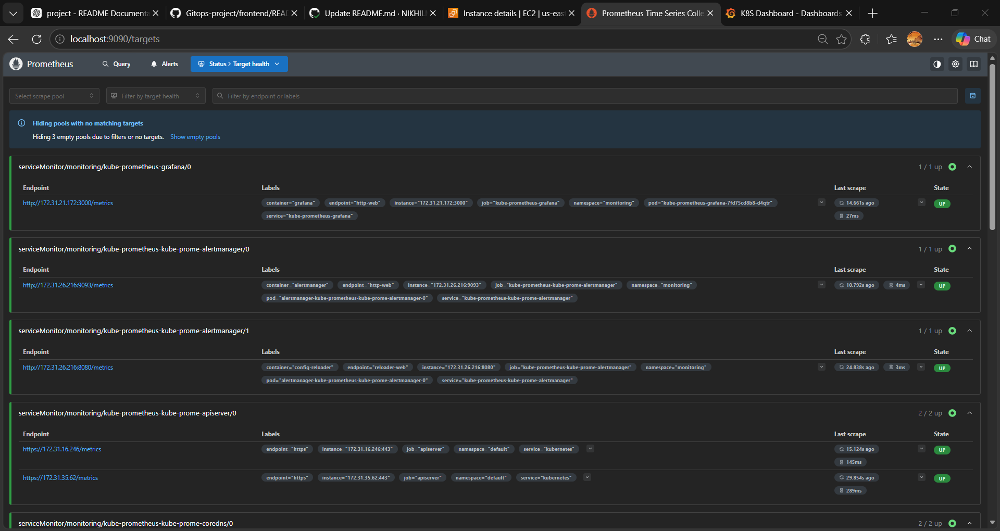
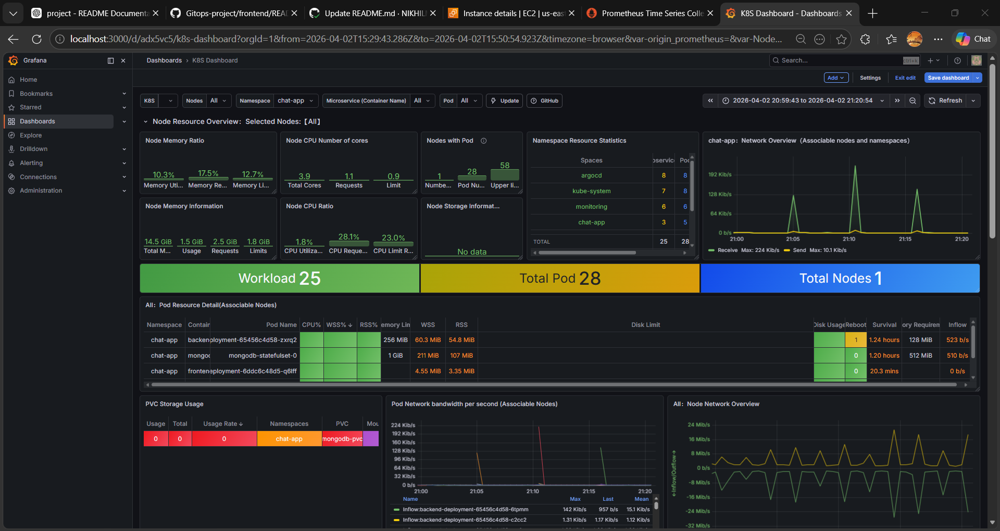

---

# 8. Application Working

The application is successfully deployed on EKS and accessible via Ingress.

### 📸 Screenshots

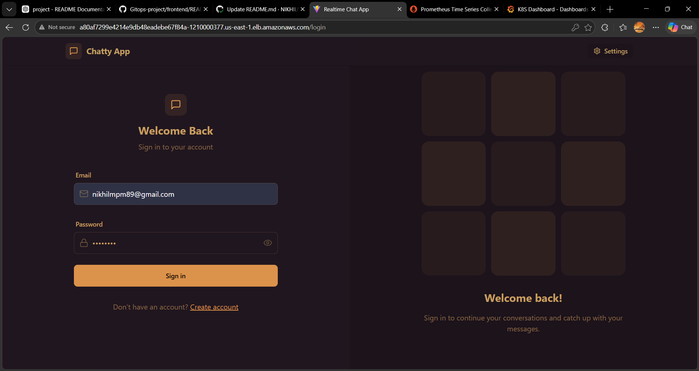
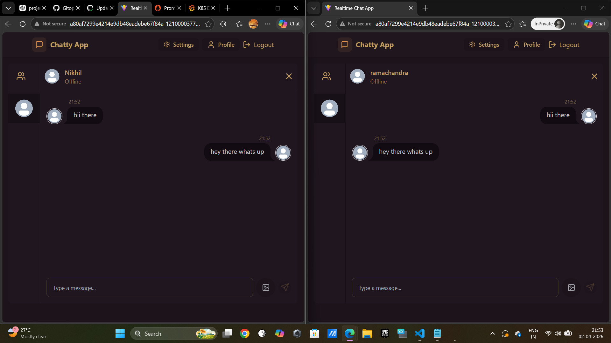

---

# ✅ Key Achievements

* Complete GitOps implementation
* Automated CI using GitHub Actions
* Automated CD using ArgoCD
* No manual deployment required
* Scalable Kubernetes architecture

---

# 🚀 Conclusion

This project demonstrates a modern **GitOps-based DevOps workflow** where:

* Terraform provisions infrastructure
* GitHub Actions handles CI
* ArgoCD manages CD
* Image Updater automates deployments

This approach ensures:

* Reliability
* Scalability
* Automation
* Faster delivery cycles
